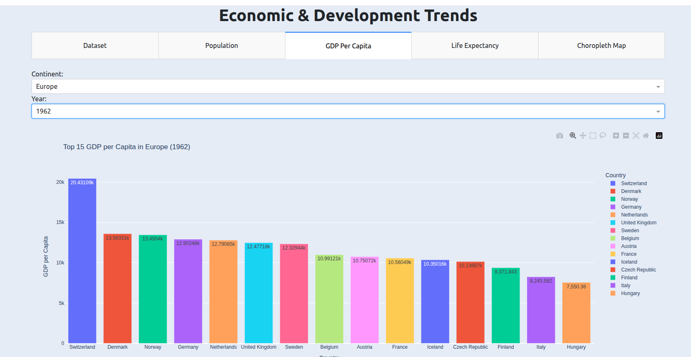

# EconoVuee-Visualizing-economic-and-development-trends

An interactive web dashboard built with Dash and Plotly Express that visualizes Population, GDP per capita and life expectancydata across different continents and years. The project uses the classic Gapminder dataset.

📊 Features
View the top 15 countries by population, GDP per capita and life expectancy by continent and year.

Dynamic filtering by continent and year.

Interactive bar charts and a choropleth map.

Clean, responsive UI styled with Bootstrap.

📦 Dependencies

Dash

Plotly

Pandas

Gunicorn (for production deployment)

📸 Screenshots

## 🌐 Live Demo

👉 [Click here to view the app](https://your-app-url.com)

📈 Dataset
This dashboard uses the Gapminder dataset, which includes:

Country
Year
Continent
GDP per Capita
Life Expectancy
Population

🙌 Acknowledgements

Gapminder.org for the dataset

Plotly & Dash for the web framework

Bootstrap for design inspiration

🧑‍💻 Author
Linet Okinyi

